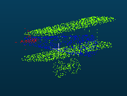

# PointNet++代码拆解

**参考github地址：**

[yanx27/Pointnet_Pointnet2_pytorch: PointNet and PointNet++ implemented by pytorch (pure python) and on ModelNet, ShapeNet and S3DIS. (github.com)](https://github.com/yanx27/Pointnet_Pointnet2_pytorch)

>conda create --name pytorch_1.6_gpu python=3.7.0
>conda activate pytorch_1.6_gpu
>conda install pytorch==1.6.0 torchvision==0.7.0 cudatoolkit=10.1 -c pytorch
>conda install tqdm

## 1、ShapeNet数据集分析

shapenet是一个部件分割的数据集

shapenetcore_partanno_segmentation_benchmark_v0_normal文件夹中：


每个文件夹就是一种物体类别，类别对应表在synsetoffset2category.txt中，如下图所示：


16中类别，每种类别有很多样本，每个样本个txt文件，


txt的格式如下：


每行是一个点，部件标签从0-49，共50个部件。

在CloudCompare中显示：




## 2、运行部件分割得训练python文件

- Run

```bash
## Check model in ./models 
## e.g., pointnet2_msg
python train_partseg.py --model pointnet2_part_seg_msg --normal --log_dir pointnet2_part_seg_msg
python test_partseg.py --normal --log_dir pointnet2_part_seg_msg
```


### 2.1 从train_partseg.py进行步步深挖


分割的类别：


解析出来的参数：


```bash
# param 输出数据：
Namespace(batch_size=4, decay_rate=0.0001, epoch=251, gpu='0', learning_rate=0.001, log_dir='pointnet2_part_seg_msg', lr_decay=0.5, model='pointnet2_part_seg_msg', normal=True, npoint=2048, optimizer='Adam', step_size=20)
```


```

```

- seg_label_to_cat={}


trans_feat是什么？


label  和 target的区别：

label：每个样本对应的种类标签     根据label算实例分割得准确率

target：每个点的类别标签       根据target算部件分割的准确率


预测出来的结果：


处理后的结果：

cur_pred_val


segp与segl的区别：

**segp：当前预测的每个点的类别**

```
segp = cur_pred_val[i, :]  # (4, 2048)   
```

**segl：当前预测的每个点的真实类别**

```
segl = target[i, :]
```


计算shape的iou：


### 2.2 一些指标及其计算规则

默认参数：

batchsize=16

epoch = 251

- 查看运行日志：

显卡：RTX2060S 8G

batchsize=12

epoch = 20


batchsize在调整好后，在训练中不可改变。epoch可以增加，从而逐步增多后续精度。

所以在确定好训练参数后，需要重新清除log文件，重新生成。


```bash
2021-05-26 20:18:10,576 - Model - INFO - The number of training data is: 13998
2021-05-26 20:18:10,576 - Model - INFO - The number of test data is: 2874
2021-05-26 20:18:11,904 - Model - INFO - Use pretrain model
2021-05-26 20:18:11,904 - Model - INFO - Epoch 1 (5/20):
2021-05-26 20:18:11,904 - Model - INFO - Learning rate:0.001000
2021-05-26 20:32:39,384 - Model - INFO - Train accuracy is: 0.93045
2021-05-26 20:35:10,460 - Model - INFO - eval mIoU of Airplane       0.783141
2021-05-26 20:35:10,460 - Model - INFO - eval mIoU of Bag            0.712723
2021-05-26 20:35:10,460 - Model - INFO - eval mIoU of Cap            0.828715
2021-05-26 20:35:10,460 - Model - INFO - eval mIoU of Car            0.723163
2021-05-26 20:35:10,460 - Model - INFO - eval mIoU of Chair          0.878602
2021-05-26 20:35:10,460 - Model - INFO - eval mIoU of Earphone       0.621496
2021-05-26 20:35:10,461 - Model - INFO - eval mIoU of Guitar         0.833964
2021-05-26 20:35:10,461 - Model - INFO - eval mIoU of Knife          0.776831
2021-05-26 20:35:10,461 - Model - INFO - eval mIoU of Lamp           0.796015
2021-05-26 20:35:10,461 - Model - INFO - eval mIoU of Laptop         0.952902
2021-05-26 20:35:10,461 - Model - INFO - eval mIoU of Motorbike      0.327134
2021-05-26 20:35:10,461 - Model - INFO - eval mIoU of Mug            0.940438
2021-05-26 20:35:10,461 - Model - INFO - eval mIoU of Pistol         0.765747
2021-05-26 20:35:10,461 - Model - INFO - eval mIoU of Rocket         0.574742
2021-05-26 20:35:10,461 - Model - INFO - eval mIoU of Skateboard     0.714146
2021-05-26 20:35:10,461 - Model - INFO - eval mIoU of Table          0.780744
2021-05-26 20:35:10,461 - Model - INFO - Epoch 5 test Accuracy: 0.916869  Class avg mIOU: 0.750656   Inctance avg mIOU: 0.802491
2021-05-26 20:35:10,461 - Model - INFO - Save model...
2021-05-26 20:35:10,461 - Model - INFO - Saving at log\part_seg\pointnet2_part_seg_msg\checkpoints/best_model.pth
2021-05-26 20:35:10,522 - Model - INFO - Saving model....
2021-05-26 20:35:10,522 - Model - INFO - Best accuracy is: 0.91687
2021-05-26 20:35:10,522 - Model - INFO - Best class avg mIOU is: 0.75066
2021-05-26 20:35:10,522 - Model - INFO - Best inctance avg mIOU is: 0.80249
.
.
.
.
2021-05-27 00:29:22,578 - Model - INFO - Epoch 16 (20/20):
2021-05-27 00:29:22,578 - Model - INFO - Learning rate:0.001000
2021-05-27 00:43:37,914 - Model - INFO - Train accuracy is: 0.93648
2021-05-27 00:46:00,830 - Model - INFO - eval mIoU of Airplane       0.787977
2021-05-27 00:46:00,830 - Model - INFO - eval mIoU of Bag            0.772902
2021-05-27 00:46:00,830 - Model - INFO - eval mIoU of Cap            0.814044
2021-05-27 00:46:00,830 - Model - INFO - eval mIoU of Car            0.752671
2021-05-27 00:46:00,830 - Model - INFO - eval mIoU of Chair          0.893701
2021-05-27 00:46:00,831 - Model - INFO - eval mIoU of Earphone       0.715975
2021-05-27 00:46:00,831 - Model - INFO - eval mIoU of Guitar         0.884926
2021-05-27 00:46:00,831 - Model - INFO - eval mIoU of Knife          0.868034
2021-05-27 00:46:00,831 - Model - INFO - eval mIoU of Lamp           0.806029
2021-05-27 00:46:00,831 - Model - INFO - eval mIoU of Laptop         0.953170
2021-05-27 00:46:00,831 - Model - INFO - eval mIoU of Motorbike      0.392648
2021-05-27 00:46:00,831 - Model - INFO - eval mIoU of Mug            0.930413
2021-05-27 00:46:00,831 - Model - INFO - eval mIoU of Pistol         0.787436
2021-05-27 00:46:00,831 - Model - INFO - eval mIoU of Rocket         0.572691
2021-05-27 00:46:00,831 - Model - INFO - eval mIoU of Skateboard     0.732901
2021-05-27 00:46:00,831 - Model - INFO - eval mIoU of Table          0.803140
2021-05-27 00:46:00,831 - Model - INFO - Epoch 20 test Accuracy: 0.931834  Class avg mIOU: 0.779291   Inctance avg mIOU: 0.823609
2021-05-27 00:46:00,831 - Model - INFO - Save model...
2021-05-27 00:46:00,831 - Model - INFO - Saving at log\part_seg\pointnet2_part_seg_msg\checkpoints/best_model.pth
2021-05-27 00:46:00,891 - Model - INFO - Saving model....
2021-05-27 00:46:00,891 - Model - INFO - Best accuracy is: 0.93285
2021-05-27 00:46:00,891 - Model - INFO - Best class avg mIOU is: 0.78181
2021-05-27 00:46:00,891 - Model - INFO - Best inctance avg mIOU is: 0.82361
```


- 测试推理的结果

```
PARAMETER ...
Namespace(batch_size=24, gpu='0', log_dir='pointnet2_part_seg_msg', normal=True, num_point=2048, num_votes=3)
The number of test data is: 2874
100%|██████████| 120/120 [04:10<00:00,  2.09s/it]
eval mIoU of Airplane       0.792679
eval mIoU of Bag            0.772989
eval mIoU of Cap            0.818695
eval mIoU of Car            0.761685
eval mIoU of Chair          0.895273
eval mIoU of Earphone       0.713275
eval mIoU of Guitar         0.886950
eval mIoU of Knife          0.863076
eval mIoU of Lamp           0.806333
eval mIoU of Laptop         0.955160
eval mIoU of Motorbike      0.390809
eval mIoU of Mug            0.935889
eval mIoU of Pistol         0.796225
eval mIoU of Rocket         0.578459
eval mIoU of Skateboard     0.734228
eval mIoU of Table          0.804036
Accuracy is: 0.93245
Class avg accuracy is: 0.79746
Class avg mIOU is: 0.78161
Inctance avg mIOU is: 0.82559

Process finished with exit code 0

```


1、评估每个类别的miou


2、Class avg mIOU: 0.779291 


3、Inctance avg mIOU: 0.823609


4、test Accuracy: 0.931834


未增加数据扰动前：一个点的示例如下


```python
points[:,:, 0:3] = provider.random_scale_point_cloud(points[:,:, 0:3]) 
```


```python
points[:,:, 0:3] = provider.shift_point_cloud(points[:,:, 0:3])
```


```

```


```python
classifier = classifier.train()
seg_pred, trans_feat = classifier(points, to_categorical(label, num_classes)) 

seg_pred   # 值为预测出来部件的结果   4,2048,20
```


num_classes:16

target：torch.Size([4, 2048])

seg_pred：torch.Size([4, 2048, 50]) -> torch.Size([8192, 50]) ->[8192]


```
test_metrics['class_avg_iou'] = mean_shape_ious
```


- 结果数据分析


```txt
2021-06-04 23:31:12,172 - Model - INFO - Epoch 251 (251/251):
2021-06-04 23:31:12,172 - Model - INFO - Learning rate:0.000010
2021-06-04 23:43:04,485 - Model - INFO - Train accuracy is: 0.95584
2021-06-04 23:44:57,128 - Model - INFO - eval mIoU of Airplane       0.828985
2021-06-04 23:44:57,129 - Model - INFO - eval mIoU of Bag            0.813650
2021-06-04 23:44:57,129 - Model - INFO - eval mIoU of Cap            0.870234
2021-06-04 23:44:57,129 - Model - INFO - eval mIoU of Car            0.774450
2021-06-04 23:44:57,129 - Model - INFO - eval mIoU of Chair          0.903383
2021-06-04 23:44:57,129 - Model - INFO - eval mIoU of Earphone       0.734245
2021-06-04 23:44:57,129 - Model - INFO - eval mIoU of Guitar         0.911734
2021-06-04 23:44:57,129 - Model - INFO - eval mIoU of Knife          0.864292
2021-06-04 23:44:57,129 - Model - INFO - eval mIoU of Lamp           0.837112
2021-06-04 23:44:57,129 - Model - INFO - eval mIoU of Laptop         0.957848
2021-06-04 23:44:57,129 - Model - INFO - eval mIoU of Motorbike      0.710170
2021-06-04 23:44:57,129 - Model - INFO - eval mIoU of Mug            0.950811
2021-06-04 23:44:57,129 - Model - INFO - eval mIoU of Pistol         0.814806
2021-06-04 23:44:57,129 - Model - INFO - eval mIoU of Rocket         0.617824
2021-06-04 23:44:57,129 - Model - INFO - eval mIoU of Skateboard     0.768687
2021-06-04 23:44:57,129 - Model - INFO - eval mIoU of Table          0.822945
2021-06-04 23:44:57,129 - Model - INFO - Epoch 251 test Accuracy: 0.943103  Class avg mIOU: 0.823823   Inctance avg mIOU: 0.849895
2021-06-04 23:44:57,129 - Model - INFO - Best accuracy is: 0.94395
2021-06-04 23:44:57,129 - Model - INFO - Best class avg mIOU is: 0.82726
2021-06-04 23:44:57,129 - Model - INFO - Best inctance avg mIOU is: 0.85323
```


```
for cat in sorted(shape_ious.keys()):  # 对应的每种类别的mIoU
    log_string('eval mIoU of %s %f' % (cat + ' ' * (14 - len(cat)), shape_ious[cat]))
```

**其中shape_ious，shape_ious是一个字典列表，总共16个字典，**

**len:16   每个字典为airplane、car、cap...它们的iou，通过算每个字典中的平均，得到每个类别的iou，如上所示。**

```python
test Accuracy: 0.943103  Class avg mIOU: 0.823823   Inctance avg mIOU: 0.849895

log_string('Epoch %d test Accuracy: %f  Class avg mIOU: %f   Instance avg mIOU: %f' % (
                 epoch+1, test_metrics['accuracy'],test_metrics['class_avg_iou'],test_metrics['instance_avg_iou']))
```

- test_metrics['accuracy']

```python
# 正确的总点数/可见的总点数
test_metrics['accuracy'] = total_correct / float(total_seen)  # 5265761/5885952
```


- test_metrics['class_avg_iou']  

mean_shape_ious = np.mean(shape_ious)    对所有值求平均，获得一个值，也就是 **平均类别IOU**

```python
mean_shape_ious = np.mean(list(shape_ious.values()))
test_metrics['class_avg_iou'] = mean_shape_ious
# 直接对所有类别求平均
```


- test_metrics['instance_avg_iou'] : 平均实例IOU

```python
all_shape_ious = []  # 代表的是2874个test数据集中，每个样本点云的正确率

for cat in shape_ious.keys():  # 计算所有shape的部件 实例iou
    for iou in shape_ious[cat]:
        all_shape_ious.append(iou)
    shape_ious[cat] = np.mean(shape_ious[cat])

test_metrics['instance_avg_iou'] = np.mean(all_shape_ious)
# 先将所有类别所有样本的准确率取出来，存到all_shape_ious中，再取平均
```


- 输出的评价

```
2021-06-04 23:44:57,129 - Model - INFO - Best accuracy is: 0.94395
2021-06-04 23:44:57,129 - Model - INFO - Best class avg mIOU is: 0.82726
2021-06-04 23:44:57,129 - Model - INFO - Best inctance avg mIOU is: 0.85323
```

每轮epoch测试后，如果效果好，就保存模型，并得到当前最佳效果。


- 这个指标没有使用上

```python
test_metrics['class_avg_accuracy'] = np.mean(  # 部件分割正确的类别点数 / 相应每个部件的点数
    np.array(total_correct_class) / np.array(total_seen_class, dtype=np.float))
```


