# PointCloud-Case-Analysis
PointCloud-Case-Analysis

点云数据：

激光雷达扫描得到

- 输入的无序性

- 近密远疏
- 非结构化数据

xyz坐标，dx dy dz法向量

点云分割

点云补全：对扫描得到不完整的点云数据，对缺失点进行补全

点云生成：无人机图像生成3D点云

点云检测：

点云配准：基础支撑

PointNet

特征提取，

backbone：输入数据转换为特征；从点转换为特征，（位置、点与点之间的关系）

点转换为向量，

如何获取3D点云数据？

雷达、深度传感器

3D数据：

modelnet40   一个样本由1w个点组成

（x,y,z,nx,ny,nz）

分类

部件分割

语义分割

三维数据处理：

多视图进行特征拼接，再分类

PointNet：End2End

- 解决无序性，需要模型具有置换不变性      点调换顺序，结果不变（max  sum等置换不变的函数）
- 直接使用置换不变函数会损失太多特征    考虑先升维，再做Max

升维：用conv1

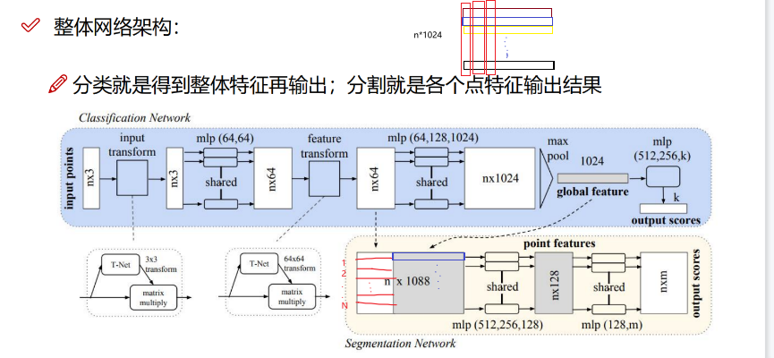

存在问题：

- 没有局部特征融合
- 没有点与点关系概念

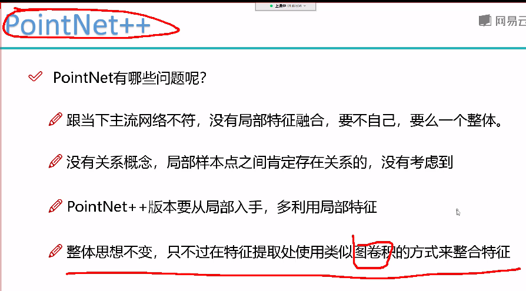

PointNet++：

类似于图卷积的方式

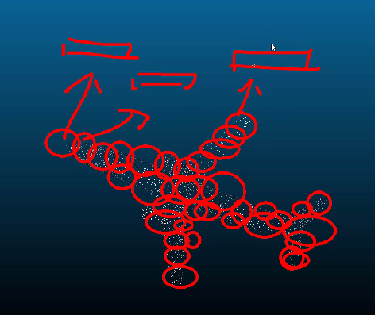

怎么画圈？

1、先找中心点

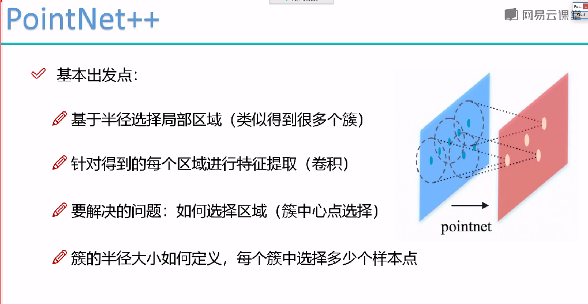

采样找到中心点，再画圈。再对每个区域提取特征。

**怎么划分区域？**

通过选出的局部区域，一个区域聚合选出一个特征向量，

**怎么选簇？簇中心点怎么选？**  FPS 使用最远点采样的方式

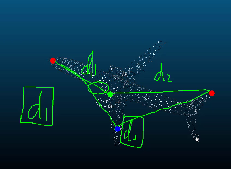

依据：尽可能全覆盖到原始图像中的每个区域

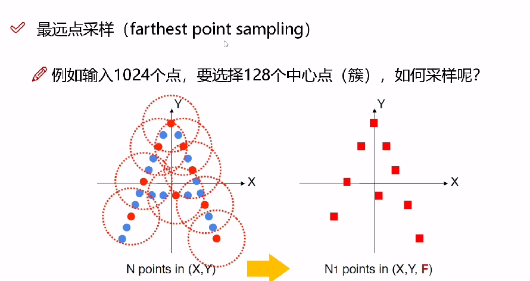

分组Group：

各个簇中的点的个数不一样该怎么办？    所有簇中，点的数量需要是一样的。 不够的复制离中心点最近的粘贴够，超出的只选固定个数的点。

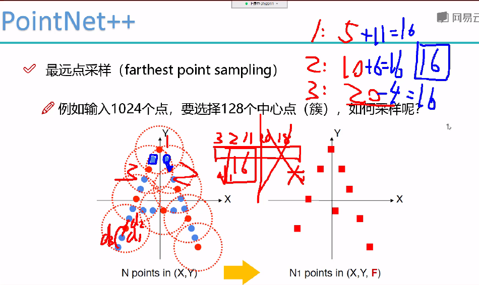

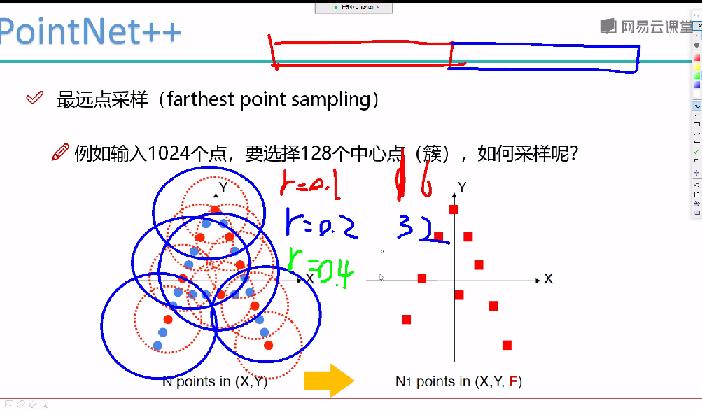

选多个半径，最后得到的特征进行拼接。

使其特征更丰富

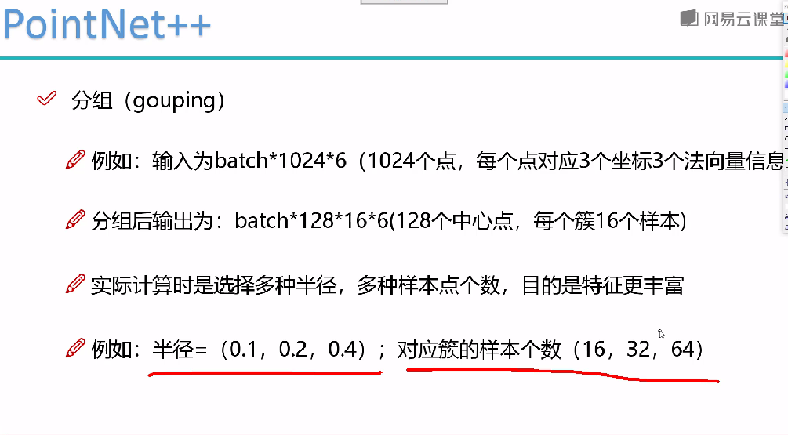

**是否可以考虑：**FPS选定128个中心点， RS选定128个中心点（**作为补充特征，可以做个消融实验进行对比下效果**），选取同样的半径，来获取     选取不同的半径

分组完成，进行每个簇提取出一个特征：

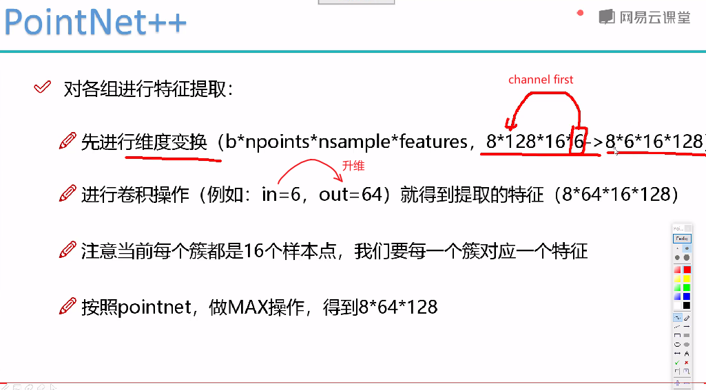

batchsize\*64维\*128簇

**采样、分组、卷积   多次**

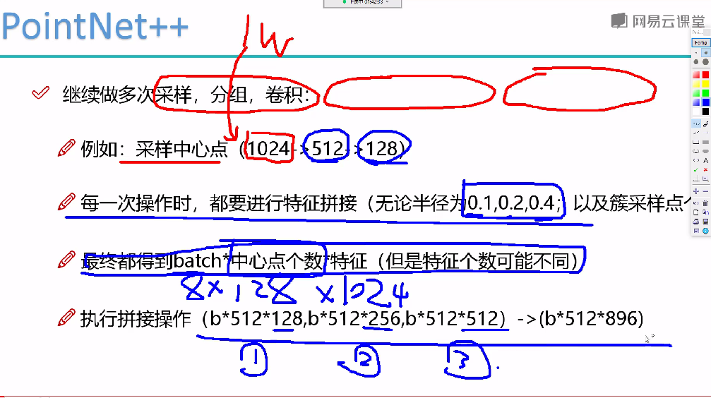

1W点采样出来1024个点进行处理，进行两次采样、分组、卷积，并将结果拼接（横向拼接）

分类：

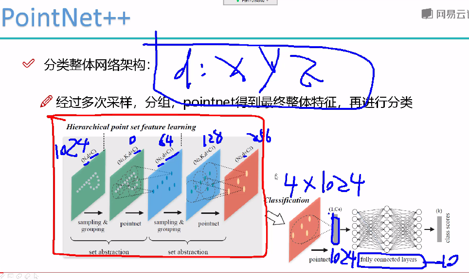

分割：

上采样：根据周围点离得距离做**插值**上采样，使用高斯分布，距离近的，权重大，距离远的权重 小。

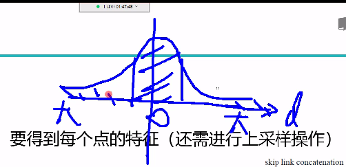

插值+拼接

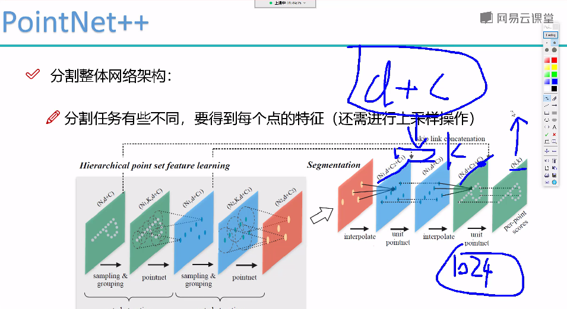

PointNet++遇到的问题：

样本点个数的影响，特别大

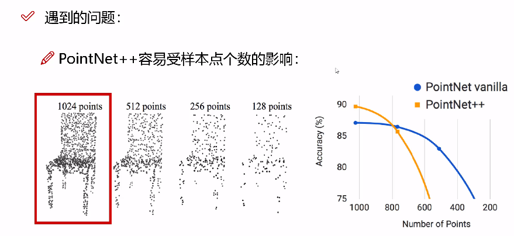

改进方式：

- 不同半径，拼接  MSG   多尺度分组

- 不同分辨率   MRG 多分辨率的方式

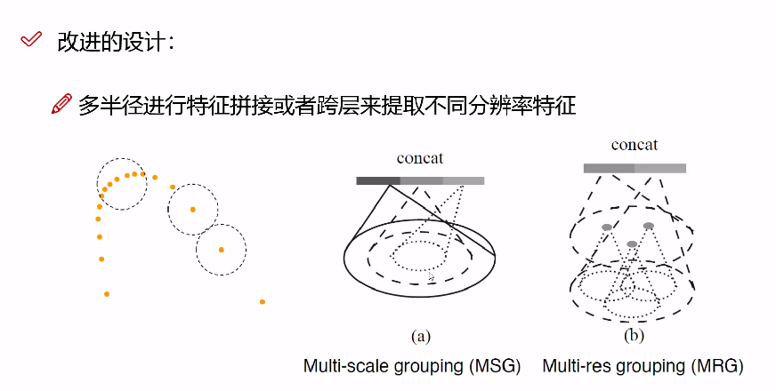

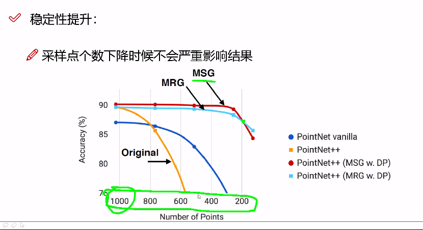

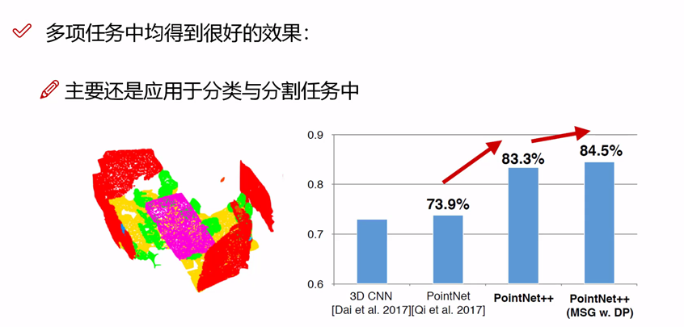

UNet：

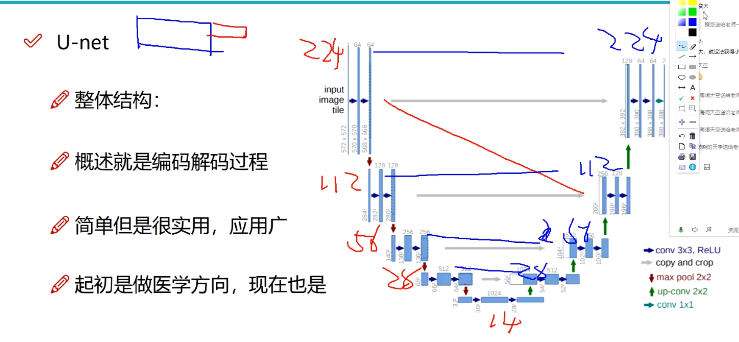

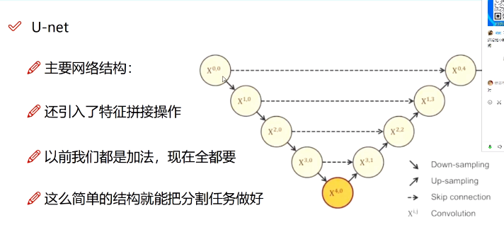

​	UNet++：

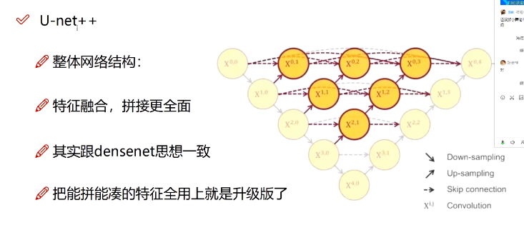

- 每层上采样，相邻拼接。

- 多监督

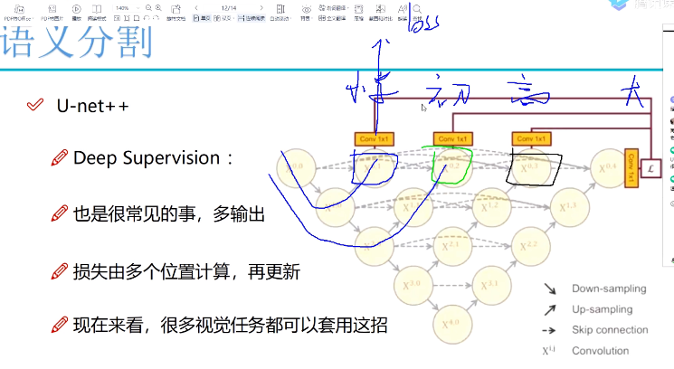

